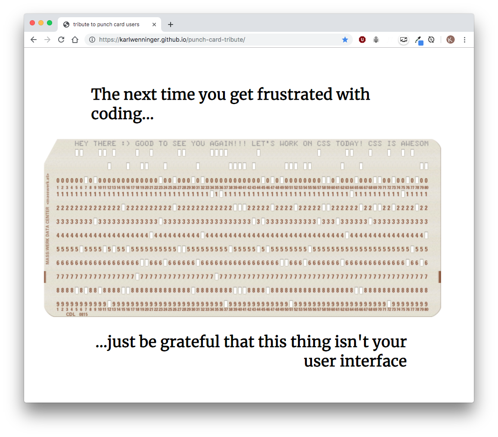

## Tribute to Punch Card Coders

My submission for [freecodecamp](https://www.freecodecamp.org/) [Responsive Web Design Projects - Build a Tribute Page](https://learn.freecodecamp.org/responsive-web-design/responsive-web-design-projects/build-a-tribute-page). 

Premise of project: while coding can be difficult and frustrating we have it pretty good compared to programmers of previous generations. Let's look at some of their technology... 

## Built With

* CSS
* HTML

## Authors

* **Karl Wenninger** - [karlWenninger](https://github.com/karlWenninger)

## License

This project is licensed under the MIT License - see the [LICENSE.md](LICENSE.md) file for details
